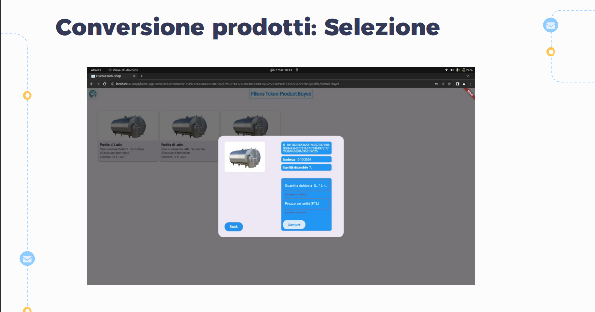

# Filiera-Token

  

  Un progetto sviluppato per il corso di Sicurezza dei Dati  
  Università di Salerno.

Benvenuti nel progetto FilieraToken!

Il sistema proposto si concentra sulla gestione della filiera lattiero-casearia attraverso un'applicazione distribuita (DApp) basata su tecnologia blockchain. Questa soluzione innovativa, chiamata FilieraToken, mira a garantire la trasparenza, l'efficienza e la tracciabilità lungo l'intera catena di produzione e distribuzione del formaggio.

### Attori della Filiera:

| Ruolo Attore | Descrizione | Immagine |
| ------------ | ----------- | -------- |
| Centro di Raccolta e Trasformazione del Latte | Il Centro di Raccolta e Trasformazione del Latte svolge un ruolo cruciale nel processo di produzione. È responsabile della raccolta del latte dalle aziende agricole, della sua trasformazione in formaggio e della distribuzione ai successivi attori della filiera. |  |
| Produttore di Formaggio | Il Produttore di Formaggio riceve il latte trasformato dal Centro di Raccolta e Trasformazione del Latte e lo utilizza per creare i prodotti caseari. Utilizzando la tecnologia blockchain, ogni passaggio nella produzione del formaggio viene registrato in modo sicuro e immutabile. |  |
| Retailer | Il Retailer è l'ultimo anello della catena di distribuzione prima che il formaggio raggiunga il consumatore finale. Grazie a CheeseChain, il Retailer può garantire ai propri clienti la provenienza e la qualità del formaggio offerto. |  |
| Consumatore | Il Consumatore rappresenta il destinatario finale del formaggio. Grazie alla tracciabilità garantita dalla tecnologia blockchain, il Consumatore può avere fiducia nell'origine e nella qualità del prodotto che sta acquistando. |  |

### Prodotti:

| Nome del Prodotto | Descrizione | Immagine |
| ----------------- | ----------- | -------- |
| CheeseBlock (Blocco di Formaggio) | Il CheeseBlock rappresenta un'unità di formaggio prodotta e distribuita lungo la filiera. Ogni CheeseBlock è unico e identificabile attraverso il suo hash sulla blockchain di CheeseChain. |  |
| CheesePiece (Pezzetto di Formaggio) | Il CheesePiece è una frazione più piccola del formaggio, spesso utilizzata per degustazioni o per la preparazione di piatti specifici. Anche il CheesePiece è tracciabile attraverso la blockchain di CheeseChain. |  |
| MilkBatch (Partita di Latte) | Il MilkBatch è una partita specifica di latte raccolto e trasformato in formaggio. Ogni MilkBatch è registrato sulla blockchain insieme alle informazioni riguardanti la sua origine e il suo percorso nella filiera. |  |

Con questo codice, le immagini verranno ridimensionate a una larghezza di 200 pixel mentre verranno visualizzate nella tabella.

## Architettura

L'architettura del sistema è composta dalle seguenti componenti e tecnologie:

### Componenti:

| Strumento/Framework | Descrizione                                                                                                                                                                            |
|----------------------|----------------------------------------------------------------------------------------------------------------------------------------------------------------------------------------|
| Docker               | Docker permette di creare un ambiente virtuale isolato per l'esecuzione di Firefly. Questo fornisce un'infrastruttura modulare e scalabile per la gestione delle applicazioni blockchain. |
| Firefly              | Firefly rappresenta il nucleo del sistema, fornendo la piattaforma e le funzionalità essenziali per la gestione della filiera lattiero-casearia tramite la tecnologia blockchain.    |
| Hyperledger Besu     | Hyperledger Besu è un client Ethereum completo che implementa la specifica Ethereum Proof of Authority (PoA). È utilizzato per l'interazione con la blockchain Ethereum e per l'esecuzione dei contratti intelligenti. |
| Truffle              | Truffle è un framework di sviluppo per la scrittura e la migrazione di smart contract. Fornisce strumenti per lo sviluppo, il testing e la distribuzione di contratti intelligenti su blockchain Ethereum. |
| HardHat              | Hardhat è un framework di sviluppo per la scrittura e la migrazione di smart contract. Fornisce strumenti per lo sviluppo, il testing e la distribuzione di contratti intelligenti su blockchain Ethereum. |

### Tecnologie:

| Tecnologia | Descrizione | Immagine |
| ---------- | ----------- | -------- |
| Python | Python è il linguaggio di programmazione utilizzato per lo sviluppo di Firefly. Offre flessibilità e facilità di sviluppo per implementare le funzionalità del sistema. [1] |  |
| Solidity | Solidity è il linguaggio di programmazione utilizzato per lo sviluppo di Hyperledger Besu. È noto per le sue prestazioni elevate e la concorrenza incorporata, rendendolo ideale per applicazioni blockchain. [2] |  |
| Flutter | Flutter è un framework open-source sviluppato da Google per la creazione di app mobili multi-piattaforma. Utilizza il linguaggio di programmazione Dart e offre un'ampia gamma di widget personalizzabili e un sistema di rendering veloce. [3] |  |
| JWT (JSON Web Token) | JWT è uno standard aperto (RFC 7519) che definisce un modo compatto e autonomo per trasmettere informazioni in sicurezza tra due parti come un oggetto JSON. È comunemente utilizzato per autenticare e autorizzare gli utenti in applicazioni web e API RESTful. [4] |  |
| Metamask | Metamask è un'estensione del browser che consente agli utenti di gestire facilmente il proprio portafoglio Ethereum e interagire con le DApp (Decentralized Applications) sulla blockchain Ethereum direttamente dal browser. [5] |  |
| Ganache | Ganache è un ambiente di sviluppo personale Ethereum che consente di eseguire test, eseguire debug e realizzare contratti, oltre ad avere una blockchain Ethereum privata per lo sviluppo. [6] |  |

### Riferimenti:

## Navigazione

Gli utenti hanno accesso alle seguenti pagine in base al loro ruolo:

- **Guest**: L'utente in modalità guest può accedere solo alle pagine di Login e SignUp per registrarsi o accedere al sistema.
- **MilkHub**: L'utente MilkHub ha accesso alle pagine di Inventory e Setting per gestire i propri dati e le proprie preferenze.
- **CheeseProducer**: L'utente CheeseProducer ha accesso alle pagine di Shop, Inventory, Setting e Product Buyed per gestire i propri prodotti, visualizzare gli acquisti passati e modificare le impostazioni.
- **Retailer**: L'utente Retailer ha accesso alle pagine di Shop, Inventory, Setting e Product Buyed per visualizzare e gestire i propri prodotti, nonché per modificare le impostazioni.
- **Consumer**: L'utente Consumer ha accesso alle pagine di Shop, Product Buyed e Setting per navigare tra i prodotti disponibili, visualizzare gli acquisti passati e modificare le impostazioni del proprio account.

### Pagine:

| Nome della Pagina | Descrizione | Immagine |
| ----------------- | ----------- | -------- |
| Login | Pagina di accesso per gli utenti registrati. Qui gli utenti possono inserire le proprie credenziali per accedere al sistema. |  |
| SignUp | Pagina di registrazione per i nuovi utenti. Qui gli utenti possono creare un nuovo account fornendo le informazioni richieste. |  |
| Shop | Pagina principale del negozio, dove gli utenti possono visualizzare e acquistare i prodotti disponibili. |  |
| Product Buyed | Pagina dove gli utenti possono visualizzare i prodotti che hanno acquistato in passato. |  |
| Inventory | Pagina dove gli utenti possono gestire i propri prodotti e metterli in vendita nel negozio. |  |
| Setting | Pagina delle impostazioni, dove gli utenti possono visualizzare e modificare le proprie informazioni personali e le preferenze del sistema. |  |

## Dapp : 

| Microservizio         | Descrizione                                                                                                                                                           | Immagine                   |
|-----------------------|-----------------------------------------------------------------------------------------------------------------------------------------------------------------------|----------------------------|
| MilkHub Microservice  | Il microservizio MilkHub gestisce le operazioni relative alla catena di distribuzione del latte, inclusa la raccolta, la trasformazione e la distribuzione ai clienti. |            |
| CheeseProducer Microservice | Il microservizio CheeseProducer gestisce le operazioni relative alla produzione di formaggio, compresa la lavorazione del latte e la creazione di prodotti caseari. |  |
| Retailer Microservice | Il microservizio Retailer gestisce le operazioni di vendita al dettaglio, inclusa la gestione degli ordini, la gestione del magazzino e l'interazione con i clienti. |          |
| Consumer Microservice | Il microservizio Consumer gestisce le operazioni relative agli utenti finali che acquistano prodotti, inclusa la visualizzazione dei prodotti disponibili e la gestione degli ordini. |          |

## UseCase

- Questi risultano essere i principali Use Case sviluppati durante il progetto : 

## Acquisto del Prodotto

L'utente una volta selezionato il prodotto e una volta inserita la quantità riceverà una notifica di avvenuta conferma dell'applicazione oppure di errore.

| | | |
| --- | --- | --- |
|  |  |  |
|  | | |

## Conversione del Prodotto

L'utente che avrà completato l'acquisto del prodotto, ha la possibilità di andare nei prodotti acquistati e provare a convertire il prodotto con la stessa modalità di acquisto: inserisce la quantità che vuole convertire e il prezzo con il quale andare a vendere il prodotto.

| | | |
| --- | --- | --- |
|  |  |  |
|  | | |

## Conclusioni

## Author
- Gerardo Leone
- Umberto Della Monica

## Tutor
- Pasquale P. Perillo 
- Pietro Catalano
- Salvatore Moscariello 

## Riferimenti e Citazioni 

1. **Docker**: 
   - [Sito Ufficiale](https://www.docker.com/)
   - [Documentazione](https://docs.docker.com/)

2. **Firefly**: 
   - [Repository GitHub](https://github.com/hyperledger-labs/firefly)
   - [Documentazione](https://docs.firefly.mikaku.ca/)

3. **Hyperledger Besu**: 
   - [Repository GitHub](https://github.com/hyperledger/besu)
   - [Documentazione](https://besu.hyperledger.org/en/stable/)

4. **Truffle**: 
   - [Sito Ufficiale](https://www.trufflesuite.com/truffle)
   - [Documentazione](https://www.trufflesuite.com/docs/truffle/overview)

5. **HardHat**: 
   - [Repository GitHub](https://github.com/nomiclabs/hardhat)
   - [Documentazione](https://hardhat.org/getting-started/)

6. **Python.org**: 
   - [Python.org](https://www.python.org/)

7. **Solidity Documentation**: 
   - [Solidity Documentation](https://docs.soliditylang.org/en/v0.8.12/)

8. **Flutter Documentation**: 
   - [Flutter Documentation](https://flutter.dev/docs)

9. **JWT.io**: 
   - [JWT.io](https://jwt.io/)

10. **Metamask Documentation**: 
   - [Metamask Documentation](https://metamask.io/)

11. **Truffle Suite - Ganache**: 
   - [Truffle Suite - Ganache](https://www.trufflesuite.com/ganache)

## Altre Risorse:

- **ERC20 - Standard di Token Ethereum**: 
   - [Specifiche ERC20](https://ethereum.org/en/developers/docs/standards/tokens/erc-20/)
   - [Documentazione](https://eips.ethereum.org/EIPS/eip-20)

## Azienda 

